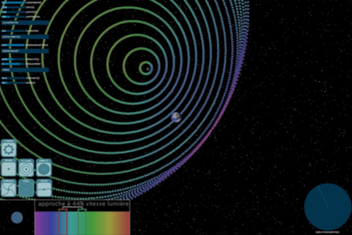
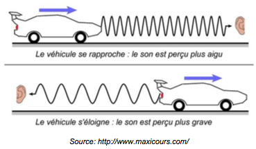
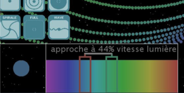
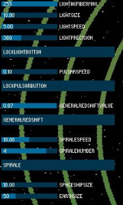
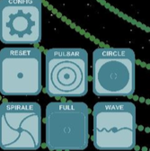

# RedShift

Processing code

Redshift is made on Processing 1.5.1. It uses the ControlP5 library. It has been tested on Processing 2.2.1 with corresponding librarie.

The program is a demonstration of the redshift effects in space.

The redshift effect is associated with two effects of frequency changes of electro-magnetic waves in space:
  - The Doppler effect
  - The space extansion effect

The Doppler effect can be experienced with sound. When a car is approaching, the sound frequency is higher. And when the car moves away, the sound frequency is deeper. The same effect is observed with electro-magnetic waves (light).

The space extansion effect is less famous. The univers is expanding and reduce the frequency of the electro-magnetic waves moving in it. As the frequency of the electro-magnetic waves, so the color of light change. It can be detected with very far objects.

This application allow us to move an object which send green light. The light goes in every directions but each point of light emitted has a different frequency so a different color depending on the movement of the sender relative to the earth. Indeed, the scale of the effect is exagerated in the application and the frequency of the electromagnetic waves are limited to the visible spectrum.

See there for more info: 
Red Shift: https://en.wikipedia.org/wiki/Redshift
Light: https://en.wikipedia.org/wiki/Light

Interface:

The light received by Earth allow use to look the difference between the color sent and the color received. With that difference we are able to know the speed of the sender.

Many parameters are available to modify the light emmitted. For example, the space expansion effect can be activated with the GeneralRedShift button.

In adition, there are several presets of configuration to help use the application.

## Install
- Download Processing https://processing.org/download/
- Download and copy controlP5 library in sketchbook ~/sketchbook/librairies http://www.sojamo.de/libraries/controlP5/ (to find your sketchbook folder, start processing: File>Preferences Sketchbook location)
- Start Processing ./processing
- Open Redshift.pde
